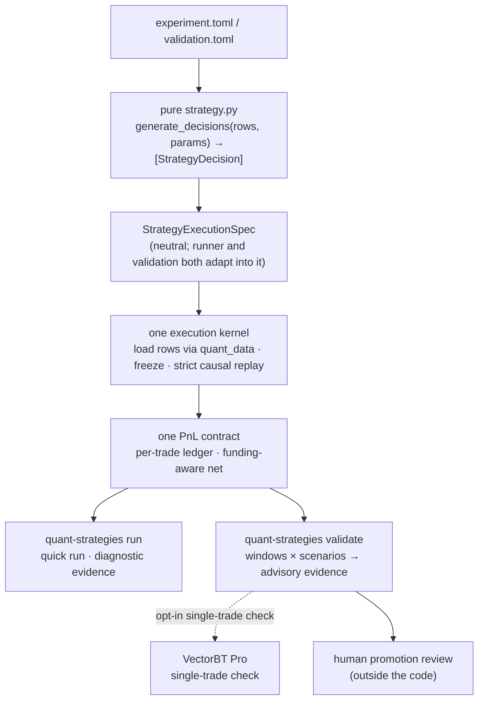

# quant_strategies

A disciplined research foundation for **pure strategy functions**,
deterministic **quick runs**, **mechanical evidence validation**, and the
approved missing **research evaluation** layer.

It is *not* a trading system and does not imply paper-trading or live-trading
readiness. Its one job is to take a strategy idea from "pure function" to
trustworthy evidence without ever letting a number with unclear semantics drive
a conclusion.

## Foundation jobs

The project contract separates three jobs:

- **Quick run**: implemented today through `quant-strategies run`; fast causal
  diagnostics for one strategy version.
- **Mechanical evidence validation**: implemented today through
  `quant-strategies validate`; retained-candidate integrity checks across
  windows and scenarios.
- **Research evaluation**: approved missing surface; stateless historical
  backtest, portfolio, economic, and path evidence for frozen candidates under
  explicit assumptions.

Validation is not research evaluation. None of these jobs authorizes paper
trading, live trading, or autonomous promotion.

## Architecture



The design has one spine:

- **One strategy contract.** A strategy is a pure `generate_decisions(rows, params)`.
- **One neutral execution spec.** Runner and validation both adapt their config
  into the same `StrategyExecutionSpec`; neither owns the other's execution path.
- **One execution kernel.** Import → validate params → load rows (via `quant_data`)
  → freeze inputs → typed decisions → strict causal replay.
- **One PnL contract.** The shared engine result is the single source of trade-level
  PnL, so **the number a human audits is the number the verdict is computed from.**
- **Two implemented public surfaces today.** A fast *quick run* for diagnostic
  evidence, and an *advisory validation run* for retained-candidate mechanical
  evidence. Research evaluation is the approved missing surface. VectorBT Pro is
  optional today, single-trade only, and never produces validation verdict metrics.

Promotion is always a separate human decision, outside this code.

## The strategy contract

Strategies are flat, single-file, and pure. They expose one callable:

```python
generate_decisions(rows, params) -> list[StrategyDecision]
```

- **Pure.** Inspect the `rows` and `params` you were handed; do not load data, call
  engines, write artifacts, loop, or mutate inputs. Computing on the given rows
  (e.g. pandas math) is fine. Purity is enforced by a **best-effort static lint**
  (`decisions/purity.py`) — a first line of defense, not a sandbox; the real
  guarantee is the contract plus review.
- **Optional `validate_params`.** A `validate_params(params) -> Mapping` hook is
  optional for the quick run (schema-less runs are flagged exploratory) but
  **required** for the validation run, so a mechanical evidence verdict never
  rests on params that were never schema-checked.
- **Typed output.** The default output is `StrategyDecision` — a stable
  `decision_id`, instrument, `open` intent, decision/as-of times, target,
  `ExitPolicy`, and `ObservationRef` lineage for consumed rows.
- **Narrow default ontology.** Equities/ETFs, FX pairs, and crypto perps with
  `open` intent and `target_weight` sizing. Futures, options, multi-leg, book
  side, and other sizings live behind explicit imports from
  `quant_strategies.decisions.extended_ontology`.
- **Documented.** Each module docstring states thesis, observables, rule,
  assumptions, provenance, and falsifier.

## Foundation Surfaces

**Quick run** — `quant-strategies run config.toml`

Loads rows, runs the pure strategy, validates the decision contract, replays for
hidden lookahead, and computes trade-level diagnostic evidence for one strategy
version. See [docs/runner.md](docs/runner.md).

**Validation run** — `quant-strategies validate candidate/validation.toml`

Runs the same kernel across configured windows and stress scenarios, then returns
advisory retained-candidate mechanical evidence. It is an evidence audit, not
research evaluation: never statistical significance, regime robustness,
portfolio quality, capacity, or promotion authority. `promotion_eligible` /
`paper_trade_eligible` / `live_eligible` always stay false. See
[docs/validation.md](docs/validation.md).

## Boundaries

- **`quant-data` owns data.** Materialization, refresh, backfill, repair, and
  source joining belong upstream. This repo uses public `quant_data` loader APIs
  only and does not discover upstream `.env` files.
- **The engine reports activity sums, not NAV.** Trade-result metrics are linear
  per-trade sums, not portfolio/NAV-path returns. Validation uses the linear
  activity sum directly; it does not compound that metric as if it were a NAV path.
- **Research evaluation is separate and not implemented yet.** Future historical
  backtest evidence, NAV/path, drawdown, exposure, benchmark-relative, and
  robustness evidence belongs in a stateless evaluation surface for frozen
  candidates, not in validation verdicts or quick-run hot paths.
- **`researched/` is not market-validated.** It may hold frozen packages from
  upstream research; validation does not treat it as special.

## Usage

Use the `quant` conda environment for all Python commands:

```bash
conda run -n quant pytest
conda run -n quant quant-strategies run path/to/config.toml
conda run -n quant quant-strategies validate path/to/candidate/validation.toml
```

## Documentation

- **[docs/runner.md](docs/runner.md)** — quick-run reference: configuration,
  evidence quality, exit codes, and artifacts.
- **[docs/validation.md](docs/validation.md)** — validation reference: config schema,
  advisory verdicts, scenario evidence, and artifacts.
- **[docs/quant-autoresearch-consumer.md](docs/quant-autoresearch-consumer.md)** —
  the stable Python consumer contract: `quant_strategies.runner.run_config` →
  `quant_strategies.runner.RunResult`, and
  `quant_strategies.validation.run_validation` → `ValidationRunResult`. No top-level
  facade is promised.

## Promotion discipline

Advisory validation artifacts support human review; they do not authorize paper
trading, live trading, or promotion. Moving a strategy to `tested/` requires a
separate promotion standard Season approves.
