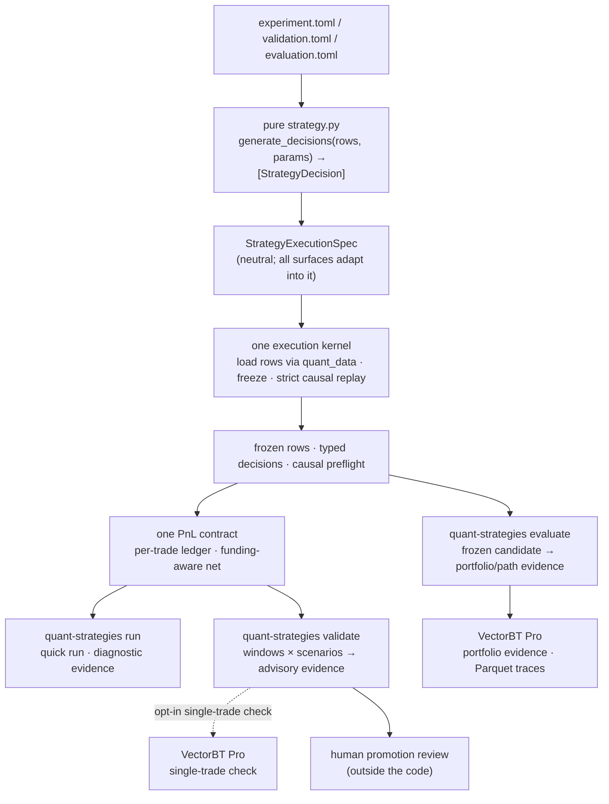

# quant_strategies

A disciplined research foundation for **pure strategy functions**,
deterministic **quick runs**, **mechanical evidence validation**, and the
implemented **research evaluation** layer.

It is *not* a trading system and does not imply paper-trading or live-trading
readiness. Its one job is to take a strategy idea from "pure function" to
trustworthy evidence without ever letting a number with unclear semantics drive
a conclusion.

Research evaluation here means stateless evidence for a supplied frozen
candidate. Candidate generation, search memory, ranking, stopping rules, and
iteration decisions remain outside this repo in `quant_autoresearch`.

## Foundation jobs

The project contract separates three jobs:

- **Quick run**: implemented today through `quant-strategies run`; fast causal
  diagnostics for one strategy version.
- **Mechanical evidence validation**: implemented today through
  `quant-strategies validate`; retained-candidate integrity checks across
  windows and scenarios.
- **Research evaluation**: implemented today through `quant-strategies evaluate`;
  stateless portfolio, economic, and path evidence for frozen candidates under
  explicit assumptions.

Validation is not research evaluation. None of these jobs authorizes paper
trading, live trading, or autonomous promotion.

## Architecture



The design has one spine:

- **One strategy contract.** A strategy is a pure `generate_decisions(rows, params)`.
- **One neutral execution spec.** Runner, validation, and evaluation adapt their
  config into the same `StrategyExecutionSpec`; none owns the other's execution
  path.
- **One execution kernel.** Import → validate params → load rows (via `quant_data`)
  → freeze inputs → typed decisions → strict causal replay.
- **One PnL contract for quick run and validation.** The shared engine result is
  the single source of trade-level PnL, so **the number a human audits is the
  number the validation decision is computed from.** Evaluation branches from
  the same frozen rows and decisions into VectorBT Pro portfolio evidence.
- **Three implemented public surfaces today.** A fast *quick run* for diagnostic
  evidence, an *advisory validation run* for retained-candidate mechanical
  evidence, and a stateless *evaluation run* for frozen-candidate portfolio,
  economic, and path evidence. VectorBT Pro remains out of validation verdict
  metrics and is required by evaluation.
- **One internal execution engine.** `quant_strategies.engine` is an internal
  kernel used by the quick-run and validation surfaces, not a fourth user-facing
  API. Internal imports and tests can use it; consumers should use the three
  public surfaces above.

Promotion is always a separate human decision, outside this code.

## The strategy contract

Strategies are flat, single-file, and pure. They expose one callable:

```python
generate_decisions(rows, params) -> list[StrategyDecision]
```

- **Pure.** Inspect the `rows` and `params` you were handed; do not load data, call
  engines, write artifacts, loop, or mutate inputs. Computing on the given rows
  (e.g. pandas math) is fine. Purity is enforced by a **best-effort static lint**
  (`decisions/purity.py`) — a first line of defense, not a sandbox; the real
  guarantee is the contract plus review.
- **Optional `validate_params`.** A `validate_params(params) -> Mapping` hook is
  optional for the quick run (schema-less runs are flagged exploratory) but
  **required** for validation and evaluation, so candidate-level evidence never
  rests on params that were never schema-checked.
- **Typed output.** The default output is `StrategyDecision` — a stable
  `decision_id`, instrument, `open` intent, decision/as-of times, target,
  `ExitPolicy`, and `ObservationRef` lineage for consumed rows.
- **Narrow default ontology.** Equities/ETFs, FX pairs, and crypto perps with
  `open` intent and `target_weight` sizing. Futures, options, multi-leg, book
  side, and other sizings live behind explicit imports from
  `quant_strategies.decisions.extended_ontology`.
- **Documented.** Each module docstring states thesis, observables, rule,
  assumptions, provenance, and falsifier.

## Foundation Surfaces

**Quick run** — `quant-strategies run config.toml`

Loads rows, runs the pure strategy, validates the decision contract, replays for
hidden lookahead, and computes trade-level diagnostic evidence for one strategy
version. Completed quick-run summaries include engine-derived
`economic_metrics` from the internal trade ledger.

**Validation run** — `quant-strategies validate candidate/validation.toml`

Runs the same kernel across configured windows and stress scenarios, then returns
advisory retained-candidate mechanical evidence. It is an evidence audit, not
research evaluation: never statistical significance, regime robustness,
portfolio quality, capacity, or promotion authority. `promotion_eligible` /
`paper_trade_eligible` / `live_eligible` always stay false.

**Evaluation run** — `quant-strategies evaluate candidate/evaluation.toml`

Runs a frozen candidate through the research evaluation surface and writes
portfolio, economic, and path evidence. Evaluation uses VectorBT Pro and writes
detailed trace artifacts as Parquet through `pyarrow`; there is no JSONL fallback
for trace-level evaluation artifacts.

Python callers use `quant_strategies.evaluation.run_evaluation` and receive
`EvaluationRunResult`.

Evaluation is not validation. It does not authorize promotion, paper trading, or live trading. Benchmark-relative metrics are deferred.

## Boundaries

- **`quant-data` owns data.** Materialization, refresh, backfill, repair, and
  source joining belong upstream. This repo uses public `quant_data` loader APIs
  only and does not discover upstream `.env` files.
- **The engine reports activity sums, not NAV.** Trade-result metrics are linear
  per-trade sums, not portfolio/NAV-path returns. Validation uses the linear
  activity sum directly; it does not compound that metric as if it were a NAV path.
- **The engine package is internal.** Do not build user workflows on
  `quant_strategies.engine`; call quick run, validation run, or evaluation run.
- **Research evaluation is separate from validation.** Historical portfolio,
  economic, and path evidence belongs in the stateless evaluation surface for
  frozen candidates, not in validation decisions or quick-run hot paths.
  Benchmark-relative metrics are deferred.
- **Research archives live outside this repo.** Search-loop archives, ranks, and
  handoff records do not live in the active foundation context. Regenerate or
  rerun evidence instead of relying on historical outputs.

## Usage

Use the `quant` conda environment for all Python commands:

```bash
conda run -n quant pytest
conda run -n quant quant-strategies run path/to/config.toml
conda run -n quant quant-strategies validate path/to/candidate/validation.toml
conda run -n quant quant-strategies evaluate path/to/candidate/evaluation.toml
```

## Documentation

- **[PRD.md](PRD.md)** — product intent, goals, non-goals, constraints, and
  durable ownership boundaries.
- **[FOUNDATION_LOCK.md](FOUNDATION_LOCK.md)** — locked contracts, accepted debt,
  deferred triggers, and review protocol.
- **[docs/foundation-surfaces.md](docs/foundation-surfaces.md)** — current quick-run,
  validation-run, and evaluation-run command/API/artifact reference.
- **[docs/vectorbtpro.md](docs/vectorbtpro.md)** — VectorBT Pro package facts and
  project boundary.
- **[AGENTS.md](AGENTS.md)** — agent operating rules for this repository.

## Promotion discipline

Advisory validation artifacts support human review; they do not authorize paper
trading, live trading, or promotion. Moving a strategy to `tested/` requires a
separate promotion standard Season approves.
