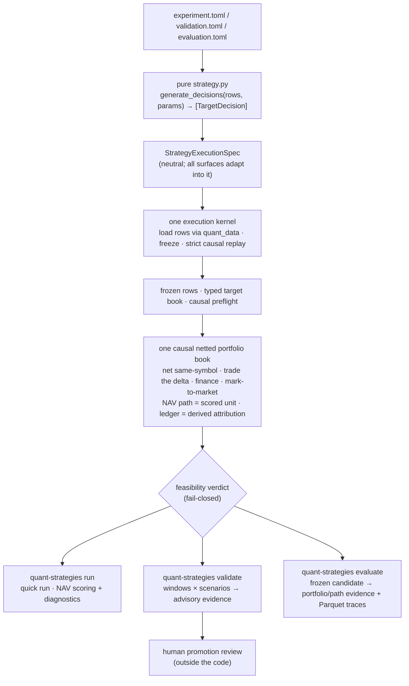

# quant_strategies

A disciplined research foundation for **pure strategy functions**,
deterministic **quick runs**, **mechanical evidence validation**, and the
implemented **research evaluation** layer.

It is *not* a trading system and does not imply paper-trading or live-trading
readiness. Its one job is to take a strategy idea from "pure function" to
trustworthy evidence without ever letting a number with unclear semantics drive
a conclusion.

The unit of simulation is **one causal, single-account portfolio**, not an
isolated trade. A strategy declares a **target book** — standing, signed
weight-of-NAV `TargetDecision`s per instrument (`0` = flat/close), idempotent so
same-symbol exposure nets and cannot stack, with optional declared price-path
`RiskRule`s. The engine folds that book into **one netted, financed, marked book**
on every surface and scores its **NAV path** as the single authoritative scored
unit; the per-trade ledger is a derived attribution view of the same walk. An
envelope breach is a typed **fail-closed** feasibility verdict, never a clamp and
never a silent `None`. See `PRD.md` G8 and `AGENTS.md`.

Research evaluation here means stateless evidence for a supplied frozen
candidate. Candidate generation, search memory, ranking, stopping rules, and
iteration decisions remain outside this repo in `quant_autoresearch`.

## Foundation jobs

The project contract separates three jobs:

- **Quick run**: implemented today through `quant-strategies run`; fast causal
  diagnostics for one strategy version.
- **Mechanical evidence validation**: implemented today through
  `quant-strategies validate`; retained-candidate integrity checks across
  windows and scenarios.
- **Research evaluation**: implemented today through `quant-strategies evaluate`;
  stateless portfolio, economic, and path evidence for frozen candidates under
  explicit assumptions.

Validation is not research evaluation. None of these jobs authorizes paper
trading, live trading, or autonomous promotion.

## Architecture



The design has one spine:

- **One strategy contract.** A strategy is a pure
  `generate_decisions(rows, params)` that emits a standing, signed,
  weight-of-NAV **target book** (`TargetDecision`s).
- **One neutral execution spec.** Runner, validation, and evaluation adapt their
  config into the same `StrategyExecutionSpec`; none owns the other's execution
  path.
- **One shared decision/spec kernel and one shared accounting book.** Quick run,
  validation, and evaluation all run the single causal netted portfolio book
  (`netted_portfolio_book_v1`); there is no separate per-surface price-evidence
  fork. Evaluation adds only Parquet trace serialization around that same pure
  book.
- **One execution kernel.** Import → validate params → load rows (via `quant_data`)
  → freeze inputs → typed target decisions → strict causal replay.
- **One model of money.** A single bar-by-bar walk nets same-symbol exposure to a
  running per-symbol quantity, trades only the delta against one shared
  cash/margin account through a market model (costs/fills/funding), and marks to
  market to produce one NAV path. **The NAV path is the single scored object**, so
  the number a human audits is the number every surface's decision is computed
  from; the per-trade ledger is a derived attribution / information-coefficient
  view of the same walk, kept first-class for alpha research but never an
  independent scored number.
- **Feasibility fails closed.** An envelope breach — intended gross/net over the
  operator-frozen leverage budget, a zero-cost scoreable run, unfinanced leverage,
  or a degenerate sample — yields a typed feasibility verdict that makes the run
  non-scoreable with an actionable reason. It is never clamped and never collapsed
  into a silent `None`; `succeeded` is gated on it.
- **Three implemented public surfaces today.** A fast *quick run* for diagnostic
  evidence, an *advisory validation run* for retained-candidate mechanical
  evidence, and a stateless *evaluation run* for frozen-candidate portfolio,
  economic, and path evidence — all over the one netted book.
- **One internal execution engine.** `quant_strategies.engine` is an internal
  execution kernel used by the quick-run and validation surfaces, not a fourth
  user-facing API. Internal imports and tests can use it; consumers should use the
  three public surfaces above.

Promotion is always a separate human decision, outside this code.

## The strategy contract

Strategies are flat, single-file, and pure. They expose one callable:

```python
generate_decisions(rows, params) -> list[TargetDecision]
```

- **Target book, not trade tickets.** Each `TargetDecision` declares, as of a
  causal time and per instrument, a **standing signed weight of NAV** (`+` long,
  `−` short, `0` = flat/close). A target holds until the next decision for that
  symbol changes it. Targets are **idempotent** — re-emitting the current target
  trades nothing — so signal-stacking is structurally inexpressible and the
  strategy is forced to reason about the whole book. The strategy owns the
  complete portfolio: allocation, sizing, netting intent, rebalancing, explicit
  exits, side, and hedging.
- **Pure.** Inspect the `rows` and `params` you were handed; do not load data, call
  engines, write artifacts, loop, or mutate inputs. Computing on the given rows
  (e.g. pandas math) is fine. Purity is enforced by a **best-effort static lint**
  (`decisions/purity.py`) — a first line of defense, not a sandbox; the real
  guarantee is the contract plus review.
- **Optional `validate_params`.** A `validate_params(params) -> Mapping` hook is
  optional for the quick run (schema-less runs are flagged exploratory) but
  **required** for validation and evaluation, so candidate-level evidence never
  rests on params that were never schema-checked.
- **Declared observations.** Validation and evaluation require decision
  observations for candidate-level evidence. Evaluation defaults to at least one
  observation and one observed symbol per decision; validation configs may also
  require specific observation fields.
- **Data/time exits are decisions; price-path exits are a declared `RiskRule`.**
  Anything derivable from data or time is an explicit `target=0` (or new) decision
  the pure strategy emits; anything derivable only from the realized price path is
  a declared `RiskRule` (stop-loss / take-profit / trailing) the engine enforces
  on the net position. A causal strategy may not read future prices to place its
  own stop — the engine, walking the book causally, is the only place a stop can
  fire.
- **Engine-enforced threshold exits.** `RiskRule` stop-loss, take-profit, and
  trailing thresholds are fractions of the position's entry mark, evaluated on the
  configured end-of-bar fill-price sample (`close` or `quote`), not intrabar
  high/low barrier orders. A fired rule latches the instrument flat until the
  strategy emits a new (different) target.
- **Narrow default ontology.** Equities/ETFs, FX pairs, and crypto perps as a
  signed weight-of-NAV target. Futures, options, and multi-leg live behind
  explicit imports from `quant_strategies.decisions.extended_ontology`.
- **Documented.** Each module docstring states thesis, observables, rule,
  assumptions, provenance, and falsifier.

## Foundation Surfaces

**Quick run** — `quant-strategies run config.toml`

Loads rows, runs the pure strategy, validates the target-book decision contract,
applies the configured causality replay policy, runs the candidate through the
single causal netted portfolio book, and scores its NAV path for one strategy
version. For Train/autoresearch iteration, `micro` replay is a cheap annotation
that never blocks scoring; complete replay remains available through explicit
strict replay and the later validation/evaluation surfaces. Completed, feasible
quick-run summaries include `portfolio_foundation` metrics — the compact summary
of the authoritative scored NAV book, computed over **at-risk bars** with a
minimum-sample gate — plus `economic_metrics`, the compact summary of the
per-trade attribution ledger derived from the same book walk. The foundation is a
dependency-light quick-run portfolio-return matrix with compact full-Train and
subwindow records, not survivor-grade evaluation evidence. Python callers receive
`RunResult`; status lives under `result.outcome`, while replayability,
row-contract, causality, and warning fields live under `result.evidence`;
trade economics live under `result.economics`, portfolio-foundation diagnostics
under `result.foundation`, and the typed feasibility verdict under
`result.feasibility`.
The runner API does not keep flat compatibility aliases for older result fields.
Use `result.succeeded` (**feasible and completed**) as the preferred terminal
success check.
A runner-stage failure or a fail-closed envelope breach returns
`result.outcome.completed is False`, sets `failure_stage` (`feasibility` on a
breach), and writes `summary.json` with `run_completed: false`.

**Validation run** — `quant-strategies validate candidates/<candidate_id>/validation.toml`

Runs the same kernel and the same single causal netted portfolio book across
configured windows and stress scenarios, then returns advisory retained-candidate
mechanical evidence. It is an evidence audit, not research evaluation: never
statistical significance, regime robustness, portfolio quality, capacity, or
promotion authority. `paper_trade_eligible` / `live_eligible` always stay false.
Validation configs require unique window IDs and explicit `[readiness]`
observation coverage. For `crypto_perp_funding`, readiness also requires
decision observations for `close`, `funding_timestamp`, `funding_rate`, and
`has_funding_event`. The verdict backend is the netted-book spine
(`verdict_source = "engine"` only); the `[agreement_oracle]` config section is
removed and a config that still sets it is rejected. An intended-gross or
unfinanced-leverage breach is the fail-closed feasibility verdict, not a
translation-layer rejection of flat/leveraged targets. Validation causality
replay defaults to complete replay and can be explicitly configured as bounded
for large-panel research runs.

**Evaluation run** — `quant-strategies evaluate candidates/<candidate_id>/evaluation.toml`

Runs a frozen candidate through the research evaluation surface and writes
portfolio, economic, and path evidence from the **same single causal netted
portfolio book** as quick run and validation; evaluation adds only Parquet trace
serialization through `pyarrow` around that pure book, with no JSONL fallback.
The VectorBT Pro and `project_perp_ledger_v1` backends are retired. Evaluation
also writes normalized input row snapshots as Parquet and decision records as
JSONL so completed evaluation metrics can be traced through the artifact package.
Annualized evaluation metrics are computed over **at-risk bars** — the
capital-deployed period returns from the `portfolio_path` trace, not a zero-padded
calendar — so flat/no-position bars do not inflate the effective sample. The
configured `annualization_periods_per_year` must match the bar cadence; completed
runs emit an advisory annualization cadence summary, `annualization_cadence`, with
warnings for cadence mismatches or insufficient observed spacing. Annualized/risk metrics (`annualized_return`, `volatility`,
`sharpe`, `sortino`, and `calmar`) are emitted only when
`annualization_cadence.status` is `ok` and `return_sample_count` meets the
minimum return-sample floor, `[metrics].min_annualized_samples` (default `20`).
Any non-ok cadence status or insufficient samples null that annualized/risk metrics
family without nulling core economics such as `total_return`, `ending_value`,
`max_drawdown`, `return_sample_count`, or `worst_period_return`.
Sortino uses downside semivariance over the full return sample and returns
`None`, not infinity, when undefined.

Python callers use `quant_strategies.evaluation.run_evaluation` and receive
`EvaluationRunResult`. Use `result.succeeded` as the preferred terminal success
check.

Evaluation is not validation. It does not authorize promotion, paper trading, or live trading.
Benchmark-relative metrics are evidence only: when `[benchmark]` is configured,
evaluation reports passive benchmark and excess total return per scenario
without ranking, promotion, paper-trading, or live-trading authority.
Evaluation causality replay defaults to complete replay and can be explicitly
configured as bounded; result provenance records the replay scope.

## Boundaries

- **`quant-data` owns data.** Materialization, refresh, backfill, repair, and
  source joining belong upstream. This repo uses public `quant_data` loader APIs
  only, bounds the supported dependency range as `quant-data>=0.1.0,<0.2.0`,
  and does not discover upstream `.env` files. `quant_data` owns stable row
  ordering for supplied rows; `quant_strategies` preserves supplied row order
  for strategy input, hashing, and execution and does not sort rows locally
  before hashing or execution.
- **The NAV path is the scored unit, the ledger is derived.** Every surface
  scores the netted single-account portfolio NAV path. The per-trade ledger is a
  derived attribution / information-coefficient view of the same book walk, kept
  first-class for alpha research but never an independent scored number.
- **Leverage is priced and bounded, never free.** Intended gross/net exposure
  above the operator-frozen leverage budget yields the fail-closed feasibility
  verdict — the book is not clamped to fit, and the breach is never collapsed into
  a silent absence of evidence. An `unfinanced_leverage` verdict keeps an
  unpriced-leverage book (an asset class whose financing is not yet modeled)
  non-scoreable; crypto-perp funding is modeled, so a perp book is not flagged by
  that verdict.
- **One funding model on every surface.** Funding is computed once, in the single
  shared netted book, as a NAV cashflow on the net held position — there is no
  separate engine-vs-evaluation funding basis and no `project_perp_ledger`
  money-model. Fillable crypto perp windows with no funding events in the open
  interval accrue zero funding; flagged funding rows still fail when malformed,
  conflicting, or mark-misaligned.
- **The engine package is internal.** Do not build user workflows on
  `quant_strategies.engine`; call quick run, validation run, or evaluation run.
- **Research evaluation is separate from validation.** Historical portfolio,
  economic, and path evidence belongs in the stateless evaluation surface for
  frozen candidates, not in validation decisions or quick-run hot paths.
  Benchmark-relative metrics are evidence only and do not rank candidates.
- **Causal replay is not statistical proof.** hidden-lookahead replay proves
  point-in-time causal replay; it does not prove out-of-sample validity and it
  does not prove freedom from in-sample fitting.
- **Research archives live outside this repo.** Search-loop archives, ranks, and
  handoff records do not live in the active foundation context. Regenerate or
  rerun evidence instead of relying on historical outputs.

## Usage

Use the `quant` conda environment for all Python commands:

```bash
make check

conda run -n quant python -m pip install -e .
conda run -n quant python -m pip install -e '.[evaluation]' -c constraints/evaluation.txt
conda run -n quant quant-strategies --help
conda run -n quant pytest
conda run -n quant quant-strategies run path/to/config.toml
conda run -n quant quant-strategies validate candidates/<candidate_id>/validation.toml
conda run -n quant quant-strategies evaluate candidates/<candidate_id>/evaluation.toml
```

Run `make check` before relying on the local environment for foundation runs.
It refreshes the editable install, checks the installed CLI, and runs the full
test suite. The accounting model is the pure-Python spine book on every surface;
evaluation needs only `pandas` and `pyarrow` (the `[evaluation]` extra) for
Parquet trace serialization, no longer `vectorbtpro`. Controlled evaluation runs
should install that stack with `constraints/evaluation.txt`; `pyproject.toml`
keeps broad optional dependency ranges for installability.

Path anchoring differs by field. CLI/API config-path lookup is repo-root
anchored when `--repo-root` / `repo_root` is provided. After a quick-run,
validation, or evaluation TOML is found, `strategy_path` resolves beside that
config file. Quick-run `output.results_dir` remains repo-root-relative and must
live under ignored `results/`; validation/evaluation output dirs remain
candidate-local.

## Documentation

- **[PRD.md](PRD.md)** — product intent, goals, non-goals, constraints, and
  durable ownership boundaries.
- **[FOUNDATION_LOCK.md](FOUNDATION_LOCK.md)** — locked contracts, accepted debt,
  deferred triggers, and review protocol.
- **[docs/foundation-surfaces.md](docs/foundation-surfaces.md)** — current quick-run,
  validation-run, and evaluation-run command/API/artifact reference.
- **[docs/vectorbtpro.md](docs/vectorbtpro.md)** — VectorBT Pro retirement note
  and library reference (kept for the named netted-book cross-check follow-on).
- **[AGENTS.md](AGENTS.md)** — agent operating rules for this repository.

## Promotion discipline

Advisory validation artifacts support human review; they do not authorize paper
trading, live trading, or promotion. Any future promotion state requires a
separate standard Season approves.
