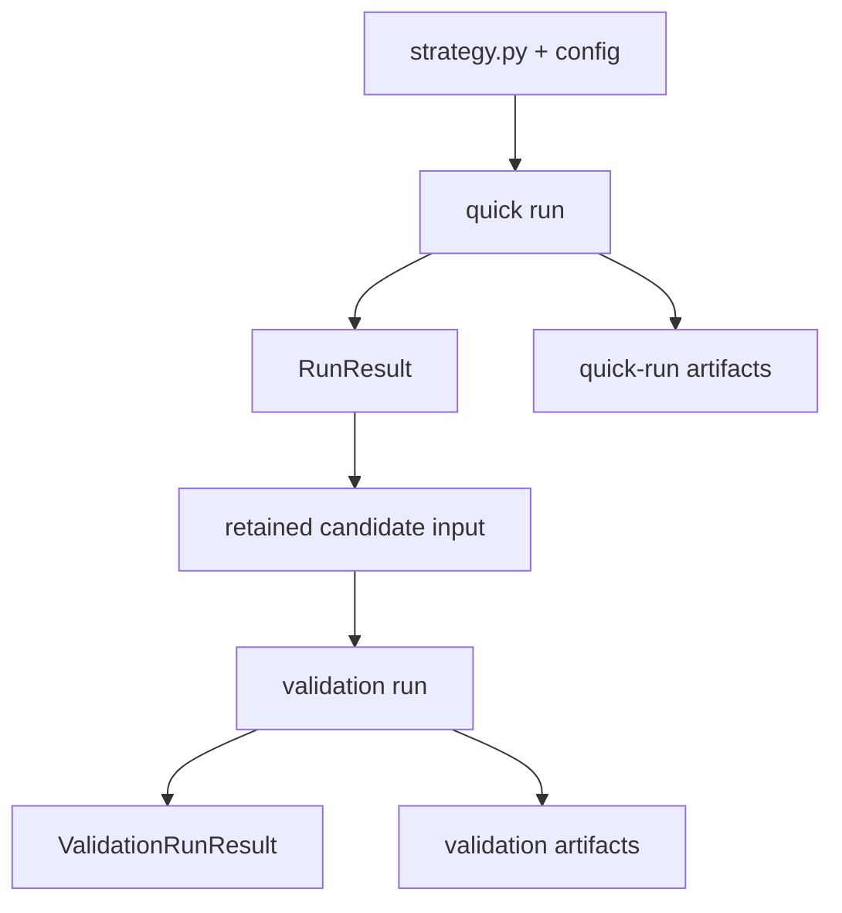

# Research Process Return Surfaces

This document states what the two research actions return.

```text
quick run      -> RunResult + quick-run artifacts
validation run -> ValidationRunResult + validation artifacts
```

It is intentionally factual. It does not define promotion rules or debugging
instructions.

## Top-Level Map




## Quick Run

Command:

```bash
conda run -n quant quant-strategies run path/to/config.toml
```

Python API:

```python
from quant_strategies.runner import run_config

result = run_config("path/to/config.toml")
```

Return type:

```python
RunResult
```

Fields:


| Field                         | Type              | Meaning                                                                                                                 |
| ----------------------------- | ----------------- | ----------------------------------------------------------------------------------------------------------------------- |
| `result_dir`                  | `Path or None`    | Result artifact directory when one was created.                                                                         |
| `notes_path`                  | `Path or None`    | Human-readable notes path when one was created.                                                                         |
| `message`                     | `str`             | Human-readable run message.                                                                                             |
| `run_completed`               | `bool`            | Whether the run completed as a structured run.                                                                          |
| `failure_stage`               | `str or None`     | Structured stage name when the run failed.                                                                              |
| `assessment_status`           | `str`             | Quick-run assessment label, such as `screened`, `quick_check_passed`, `quick_check_failed`, `quick_check_unverified`, or `runner_failed`. |
| `promotion_eligible`          | `bool`            | Always false for quick-run output.                                                                                      |
| `param_contract`              | `str`             | `validated`, `unvalidated_passthrough`, or `unknown`.                                                                   |
| `artifact_trust_tier`         | `str or None`     | Artifact replayability tier.                                                                                            |
| `data_availability_status`    | `str or None`     | Data availability status when data loading is reached.                                                                  |
| `availability_coverage`       | `dict or None`    | Data coverage payload when data loading is reached.                                                                     |
| `row_contract`                | `dict or None`    | Row contract payload when row normalization/audit is reached.                                                           |
| `causality_verified`          | `bool`            | Whether the run has full causality verification.                                                                        |
| `emitted_replay_verified`     | `bool`            | Whether emitted decisions replayed under available rows.                                                                |
| `strict_no_emission_verified` | `bool`            | Whether strict no-emission replay was verified.                                                                         |
| `evidence_quality_warnings`   | `tuple[str, ...]` | Warning strings attached to evidence quality.                                                                           |


CLI output:


| Condition                             | stdout                        | Exit code |
| ------------------------------------- | ----------------------------- | --------- |
| run completed without failure stage   | `result.result_dir`           | `0`       |
| data/readiness/audit failure stage    | failure message or notes path | `3`       |
| other failure stage or incomplete run | failure message or notes path | `1`       |


Common quick-run artifact files:


| Artifact                        | Present when                                         |
| ------------------------------- | ---------------------------------------------------- |
| `config.toml`                   | artifact initialization succeeds                     |
| `strategy_snapshot.py`          | strategy file is available                           |
| `run_manifest.json`             | run artifacts are finalized                          |
| `environment.json`              | run artifacts are finalized                          |
| `summary.json`                  | run artifacts are finalized                          |
| `notes.md`                      | run artifacts are finalized                          |
| `data_manifest.json`            | data loading is reached                              |
| `diagnostics.json`              | completed diagnostic-profile run                     |
| `artifact_profile_summary.json` | completed summary-profile run                        |
| `strategy_input_rows.jsonl`     | full-profile run reaches data loading                |
| `decision_records.jsonl`        | full-profile run reaches decision output             |
| `engine_request.json`           | full-profile run reaches engine request construction |
| `evidence.json`                 | full-profile run reaches engine evidence writing     |


Important quick-run output values:


| Value                                        | What it is                                                               |
| -------------------------------------------- | ------------------------------------------------------------------------ |
| `assessment_status`                          | Quick-run assessment, not validation verdict.                            |
| `trade_result.sum_signed_trade_activity_*`    | Linear signed trade-activity sums, not NAV returns.                      |
| `artifact_trust_tier = "search_only"`        | Compact quick-run evidence; not fully replayable from artifacts alone.       |
| `artifact_trust_tier = "audit_replayable"`   | Fuller artifact set intended for replay/audit of trade-result metrics.          |
| `param_contract = "unvalidated_passthrough"` | Strategy did not define `validate_params`; quick run still completed.    |


## Validation Run

Command:

```bash
conda run -n quant quant-strategies validate path/to/candidate/validation.toml
```

Python API:

```python
from quant_strategies.validation import run_validation

result = run_validation("path/to/candidate/validation.toml")
```

Return type:

```python
ValidationRunResult
```

Fields:


| Field           | Type                       | Meaning                                                      |
| --------------- | -------------------------- | ------------------------------------------------------------ |
| `result_dir`    | `Path or None`             | Result artifact directory when one was created.             |
| `decision`      | `ValidationPolicyDecision` | Advisory validation decision object.                         |
| `message`       | `str`                      | Human-readable validation message.                           |
| `run_completed` | `bool`                     | Whether validation completed as a structured validation run. |
| `failure_stage` | `str or None`              | Structured stage name when validation failed.                |


`ValidationPolicyDecision` fields:


| Field                      | Type              | Meaning                                                                                             |
| -------------------------- | ----------------- | --------------------------------------------------------------------------------------------------- |
| `decision`                 | `str`             | Current verdict label: `hard_no`, `mechanical_pass`, `watchlist`, or `mechanical_review_candidate`. |
| `reasons`                  | `tuple[str, ...]` | Stable reason strings attached to the decision.                                                     |
| `advisory_decision`        | `str or None`     | Additional advisory decision value when present.                                                 |
| `evidence_class`           | `str`             | Evidence class, currently validation advisory evidence.                                             |
| `promotion_eligible`       | `bool`            | Always false.                                                                                       |
| `paper_trade_eligible`     | `bool`            | Always false.                                                                                       |
| `live_eligible`            | `bool`            | Always false.                                                                                       |
| `requires_manual_approval` | `bool`            | Always true.                                                                                        |
| `passed_gates`             | `tuple[str, ...]` | Policy gates that passed.                                                                           |
| `failed_gates`             | `tuple[str, ...]` | Policy gates that failed.                                                                           |
| `gate_details`             | `dict[str, str]`  | Gate-by-gate detail strings.                                                                        |
| `overfit_controls`         | `dict`            | Search-pressure disclosure copied into the decision payload.                                        |


CLI output:


| Condition                                        | stdout                           | Exit code |
| ------------------------------------------------ | -------------------------------- | --------- |
| validation completes with non-`hard_no` decision | `message; artifacts: result_dir` | `0`       |
| validation completes with `hard_no`              | `message; artifacts: result_dir` | `2`       |
| data/readiness/audit failure stage               | `message; artifacts: result_dir` | `3`       |
| other failure stage or incomplete run            | `message; artifacts: result_dir` | `1`       |
| config load exception                            | `validation failed: ...`         | `1`       |


Validation artifact files:


| Artifact                                            | Contents                                                                             |
| --------------------------------------------------- | ------------------------------------------------------------------------------------ |
| `validation_config.toml`                            | Copied validation config.                                                            |
| `strategy_snapshot.py`                              | Copied strategy file.                                                                |
| `decision_records.jsonl`                            | Strategy decisions emitted during validation.                                        |
| `data_rows/<window_id>.jsonl`                       | Canonical row snapshot per loaded window.                                            |
| `data_audit.json`                                   | Row and observation audit payload.                                                   |
| `backend_runs/summary.json`                         | Per-scenario backend metrics and metadata.                                           |
| `backend_runs/decision_records/<scenario_id>.jsonl` | Per-scenario decision records used for backend execution.                            |
| `backend_runs/trade_ledgers/<scenario_id>.jsonl`    | Per-scenario engine trade ledger.                                                    |
| `robustness_matrix.json`                            | Current cost/fill scenario summary.                                                  |
| `validation_decision.json`                          | Serialized `ValidationPolicyDecision`.                                               |
| `validation_manifest.json`                          | Hashes, replayability, provenance, and artifact inventory.                           |
| `environment.json`                                  | Runtime and package environment.                                                     |
| `validation_report.md`                              | Human-readable validation report.                                                    |


Important validation output values:


| Value                                               | What it is                                                                                 |
| --------------------------------------------------- | ------------------------------------------------------------------------------------------ |
| `decision.decision = "hard_no"`                     | Required mechanical checks failed.                                                         |
| `decision.decision = "mechanical_pass"`             | Mechanical execution checks passed; not paper/live/promotion authorization.                |
| `decision.decision = "watchlist"`                   | Positive evidence with caveats or failed paper-readiness/search-pressure gates.            |
| `decision.decision = "mechanical_review_candidate"` | Mechanical validation plus paper-readiness gates passed without search-pressure downgrade. |
| `promotion_eligible = false`                        | Validation does not promote.                                                               |
| `paper_trade_eligible = false`                      | Validation does not authorize paper trading.                                               |
| `live_eligible = false`                             | Validation does not authorize live trading.                                                |
| `requires_manual_approval = true`                   | Human approval remains required.                                                           |
| `verdict_replayable` in manifest                    | Whether required completed verdict scenarios have trade ledgers.                           |
| `net_return`                                        | Linear signed trade-activity sum, not NAV-path return.                                     |


## Target Output Vocabulary After Simplification

Current validation labels are:

```text
hard_no
mechanical_pass
watchlist
mechanical_review_candidate
```

Target operator-facing labels after simplification:

```text
hard_no
watchlist
review_candidate
```

Mapping intent:


| Current value                 | Target operator meaning                                               |
| ----------------------------- | --------------------------------------------------------------------- |
| `hard_no`                     | `hard_no`                                                             |
| `mechanical_pass`             | internal/weaker mechanical state, or removed as operator-facing label |
| `watchlist`                   | `watchlist`                                                           |
| `mechanical_review_candidate` | `review_candidate`                                                    |


## Target Artifact Vocabulary After Simplification

Current validation artifact:

```text
robustness_matrix.json
```

Target artifact name:

```text
cost_fill_sensitivity.json
```

Reason:

```text
current scenarios vary cost and fill assumptions; they do not regenerate
decisions across parameter scenarios
```

## Minimal Return Summary

```text
quick run returns:
  RunResult
  result_dir with quick-run artifacts
  CLI exit code 0, 1, or 3

validation run returns:
  ValidationRunResult
  decision: ValidationPolicyDecision
  result_dir with validation artifacts
  CLI exit code 0, 1, 2, or 3
```
